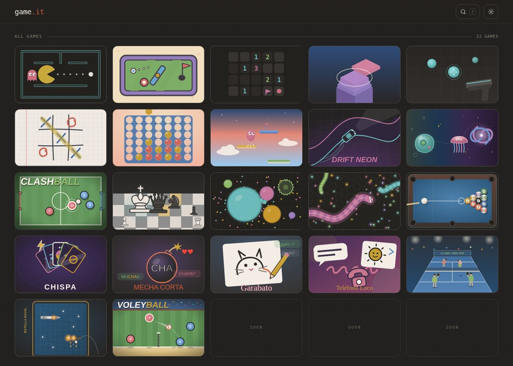
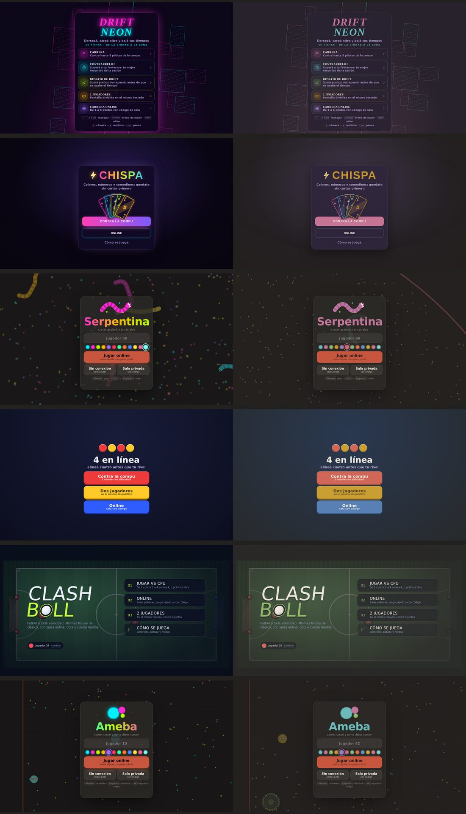
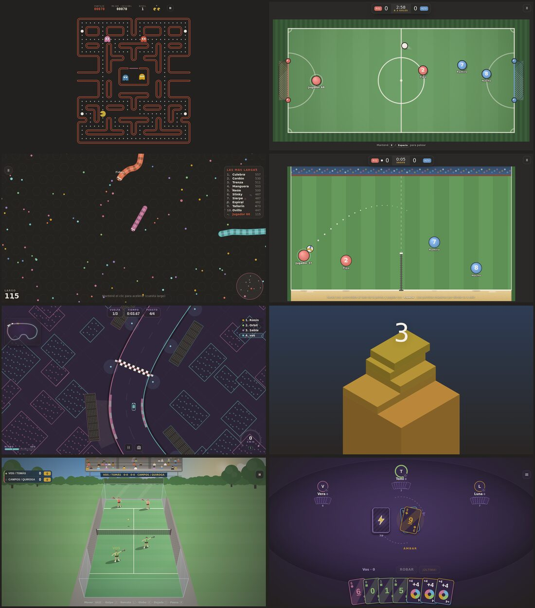
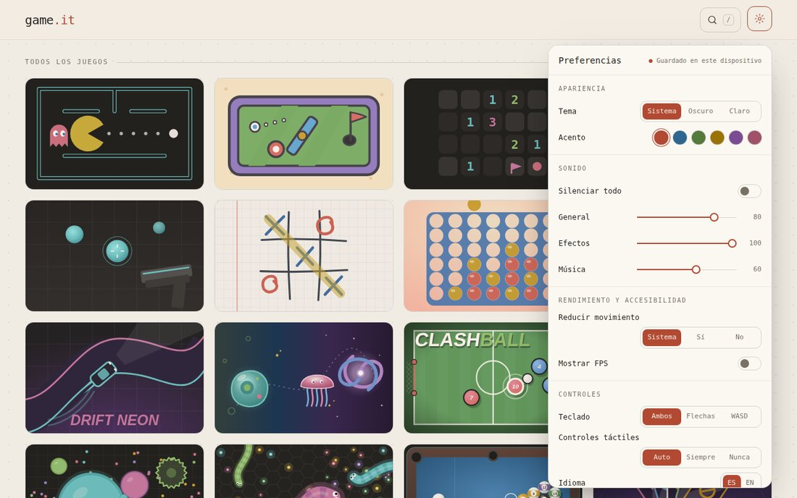

# Mis juegos

Tu copia de los juegos de [game.it](https://github.com/emitejadaa/game.it), para jugar en tu compu sin depender del repo
original:

- **El portal y los 22 juegos** (Voleyball incluido), con todo el historial del original.
- **Colores lisos en tono tierra**: fondo gris cálido, terracota, petróleo, oliva, mostaza, ciruela y rosa viejo. Sin
  colores flúor, sin brillos ni bordes que resplandecen. Los degradés de varios colores de títulos y botones pasaron a
  un solo color. También anda el tema claro.
- **Sin anuncios** y con el **servidor online propio**: se juega online desde tu compu, con otros en la misma red.
- **Un doble clic para jugar**: `jugar.bat` (Windows) o `./jugar.sh` (Mac y Linux).



## Jugar ya

1. Instalá [Node.js](https://nodejs.org/) 20 o más nuevo, si no lo tenés.
2. Bajá `mis-juegos.zip`: abrilo acá en GitHub y tocá **Download raw file**. Descomprimilo.
3. Abrí la carpeta `mis-juegos` y hacé doble clic en `jugar.bat`. La primera vez instala lo necesario (tarda un
   minuto) y después abre los juegos en el navegador, en `http://localhost:5173`.

Para jugar online con alguien de tu misma red wifi, la ventana de `jugar.bat` muestra otra dirección
(`http://192.168.…:5173`): la abren en su compu o celular. Si Windows pregunta por el firewall, dejá pasar a Node.

## Pasarlo a tu propio repo de GitHub

El zip ya es un repo de git, con todo el historial. Falta solo el repo vacío en GitHub:

1. Entrá a <https://github.com/new>. Nombre: `mis-juegos`. Marcá **Private**. No agregues README, .gitignore ni
   licencia (tiene que quedar vacío). **Create repository**.
2. Avisame en el chat y lo subo yo. O subilo vos: en la carpeta `mis-juegos`, abrí una terminal y corré

   ```bash
   git remote add origin https://github.com/IgnacioBritoss/mis-juegos.git
   git push -u origin main
   ```

Conviene que sea privado: el código es de Tejada y el repo original no tiene licencia.

## Antes y después

A la izquierda, el original; a la derecha, la copia en tono tierra.



Jugando (Pac-Man, Clashball, Serpentina, Voleyball, Drift, Stack, Pádel y Chispa):



Tema claro y preferencias (los acentos tienen nombre: terracota, petróleo, oliva, mostaza, ciruela y rosa viejo):



## Cómo se hizo

- **El portal:** los colores del tema oscuro y del claro, terracota como acento por defecto y sin el interruptor de
  "Brillo neón". Los juegos reciben estos colores y el brillo apagado.
- **Los juegos:** `npm run tierra` (en `tools/tierra.mjs`) pasó cada color escrito en el código a su versión tierra:
  menos saturación, tonos llevados hacia la paleta y negros y blancos puros más suaves. También sacó los brillos del CSS
  y de las miniaturas. La misma cuenta está en `public/shared/tierra.js`, para los colores que algunos juegos calculan
  mientras corren (Sky Hop y Stack).
- **A mano:** la comida de Serpentina, las partículas de Evolución, el marco del tablero de Batalla Naval, el cielo de
  Sky Hop, los títulos y botones con degradé, el halo de Chispa y el pizarrón verde del Ta-te-ti.
- **Probado:** `npm run check` y `npm run build` pasan. Los 22 juegos abren sin errores en la consola. En los que se
  juegan solos o contra la compu entré a una partida, y Garabato y Teléfono Loco (que son solo online) los probé
  creando una sala. El online anda con dos jugadores (sala, bots, partido y chat). El zip arranca desde cero con
  `jugar`: instala lo necesario solo y levanta los juegos y el servidor.

Si más adelante traés un juego nuevo del repo original, `npm run tierra` lo pasa a la paleta (solo toca los juegos que
todavía no pasó) y avisa qué revisar a mano. Está explicado en el README del zip.
